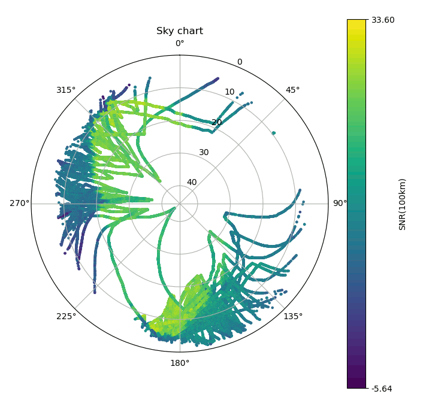

Plot the path of radiosondes in the sky from logfiles created by [radiosonde_auto_rx](https://github.com/projecthorus/radiosonde_auto_rx)

Syntax:
python ./sondeplot.py [--nodfm] [list of logfiles]

--nodfm removes DFM sondes from the plot
